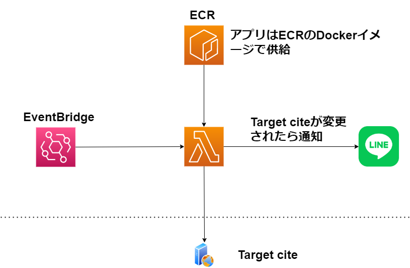

# notify-web-update

このプロジェクトは指定されたウェブサイトの特定のコンポーネントが変化した際に、LINE Notifyを介して通知を行うアプリケーションです。

実装例としては、[チケットサイト](https://eplus.jp/sf/detail/0158310001-P0030052?P6=001&P1=0402&P59=1)の商品が再販されたら時にLINE通知されるようになっている。
スクレイピングのロジックはweb/scraper.goに実装されているため、目的に応じて修正する。

本プロジェクトでは以下の技術を主に使用しています：

- **Go言語**: サービスのバックエンドの開発に利用。
- **AWS Lambda**: スクリプトの実行環境として利用。
- **Docker**: アプリケーションのコンテナ化とデプロイのために利用。
- **AWS Elastic Container Registry (ECR)**: Dockerイメージのプライベートリポジトリとして利用。
- **AWS Command Line Interface (CLI)**: AWSリソースの管理とデプロイに利用。

## 実行環境

本プロジェクトの実行環境はDockerfileで提供しており、docker imageをAWS ECRにプッシュし、LambdaとECRを連携して利用します。



## 運用環境の構築

### LINEトークンの取得

1. [LINE Notify](https://notify-bot.line.me/ja/)にログインし、新しいトークンを発行します。
2. 後ほどAWS Lambdaの環境変数でこのトークンを使用します。

### Amazon ECRリポジトリの作成

1. AWSのダッシュボードに示されているプッシュコマンドを実行し、dockerイメージをECRにプッシュします。

### Lambda関数の作成

1. Lambdaのダッシュボードで新しい関数を作成します。関数の作成方法はコンテナイメージを使用します。
2. アーキテクチャはx86_64を選択します。
3. 作成したLambda関数の設定画面で、先ほど取得したLINEトークンを環境変数LINE_NOTIFY_TOKENとして設定します。
4. トリガーとしてEventBridgeを設定する。


# ローカル実行

AWS SAMを用いてローカル実行をする。
local_run.shの冒頭にLINE Tokenを設定して、スクリプトを実行する。
```
$ ./local_run.sh
```

## プロジェクト構成（参考）

```text
    /modules
        /line
            notifier.go // LINEへの通知を行うロジック
        /web
            scraper.go // ウェブスクレイピングのロジック
    main.go // AWS Lambdaから呼び出されるメインのハンドラー関数
    Dockerfile
    .gitignore
    README.md
    go.mod
    go.sum
